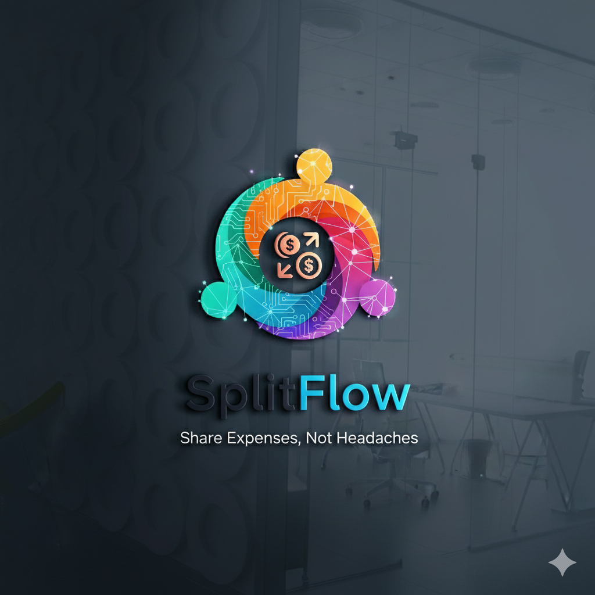

# 🚀 Aashish Joshi — Portfolio Website

A modern, animated personal portfolio showcasing my projects, skills, and experience as a full-stack developer.



---

## ✨ Features

| Feature | Description |
|---------|-------------|
| **Animated Hero Section** | Dynamic starfield background with typing effect |
| **Live GitHub Projects** | Fetches and displays pinned repositories in real-time |
| **Interactive Cards** | 3D tilt effect on about cards, flip cards for favorites |
| **Contact Form** | Server-side email handling via Nodemailer |
| **Responsive Design** | Mobile-first approach with smooth transitions |
| **Accessibility** | Respects `prefers-reduced-motion` user preference |
| **Performance Optimized** | Lazy loading, caching, and compression |

---

## 📁 Project Structure

```
portfolio-website/
├── index.html          # Main HTML entry point
├── style.css           # Custom styles & animations
├── script.js           # Client-side JavaScript (modular)
├── server.js           # Express backend (API + static serving)
├── projects.json       # Fallback project data
├── myresume.pdf        # Downloadable resume
├── package.json        # Node.js dependencies
├── .gitignore          # Git ignore rules
├── .env                # Environment variables (not committed)
└── img/                # Image assets
    ├── book_image.png
    ├── gemini_image.png
    ├── jon_jones.png
    ├── Lin_Dan.jpg
    └── Walter_white.jpg
```

---

## 🛠️ Tech Stack

### Frontend
- **HTML5** — Semantic markup
- **CSS3** — Custom properties, animations, glassmorphism
- **Tailwind CSS** — Utility classes via CDN
- **Vanilla JavaScript** — ES6+ modules

### Backend
- **Node.js** + **Express** — Server & API routes
- **Nodemailer** — Contact form email delivery
- **Axios** — GitHub API requests
- **Compression** — Gzip for faster responses

---

## 🚀 Getting Started

### Prerequisites
- [Node.js](https://nodejs.org/) v18+ installed
- GitHub personal access token (optional, for live projects)
- Gmail app password (optional, for contact form)

### Installation

```bash
# Clone the repository
git clone https://github.com/aashish000000/portfolio-website.git
cd portfolio-website

# Install dependencies
npm install
```

### Environment Variables

Create a `.env` file in the root directory:

```env
# Server
PORT=3000

# GitHub API (optional - falls back to projects.json)
GITHUB_TOKEN=your_github_personal_access_token

# Email (required for contact form)
EMAIL_USER=your.email@gmail.com
EMAIL_PASS=your_gmail_app_password
```

> **Note:** For Gmail, you need to generate an [App Password](https://support.google.com/accounts/answer/185833) with 2FA enabled.

### Run Locally

```bash
# Start the server
npm start

# Open in browser
# http://localhost:3000
```

---

## 📡 API Endpoints

| Method | Endpoint | Description |
|--------|----------|-------------|
| `GET` | `/` | Serves the main portfolio page |
| `GET` | `/api/github-projects` | Returns pinned GitHub repositories |
| `POST` | `/api/send` | Handles contact form submissions |

### Example: GitHub Projects Response

```json
[
  {
    "id": 123456789,
    "title": "Expense Splitter",
    "description": "A full-stack web app for group expense management...",
    "githubUrl": "https://github.com/aashish000000/Expense-Splitter",
    "stars": 5,
    "language": "JavaScript"
  }
]
```

---

## 🎨 Customization

### Pinned Repositories

Edit the `pinnedRepos` array in `server.js` to display specific projects:

```javascript
const pinnedRepos = ['Expense-Splitter', 'CS230-Stock_Price', 'your-repo-name'];
```

### Color Scheme

Modify CSS variables in `style.css`:

```css
:root {
    --color-bg: #0f172a;       /* Background */
    --color-primary: #22d3ee;  /* Accent (cyan) */
    --color-secondary: #818cf8; /* Secondary (indigo) */
}
```

### Typing Animation Words

Update the `words` array in `script.js`:

```javascript
const words = [
    'Computer Science Student',
    'Aspiring Software Developer',
    'Full-Stack Enthusiast'
];
```

---

## 🌐 Deployment

### Render (Recommended)

1. Push code to GitHub
2. Connect repository to [Render](https://render.com)
3. Set environment variables in Render dashboard
4. Deploy as a **Web Service** with:
   - Build Command: `npm install`
   - Start Command: `npm start`

### Vercel / Netlify (Static Only)

For static deployment without the backend:
- Remove server dependencies
- Update `index.html` to use static `projects.json`

---

## 📄 License

This project is licensed under the **ISC License**.

---

## 🤝 Connect With Me

<p align="center">
  <a href="https://github.com/aashish000000">
    
  </a>
  <a href="https://linkedin.com/in/aa-joshi">
    
  </a>
  <a href="https://www.instagram.com/__aashishthegreat/">
    
  </a>
</p>

---

<p align="center">
  <strong>Made with ❤️ by Aashish Joshi</strong><br>
  <sub>© 2025 All Rights Reserved</sub>
</p>

